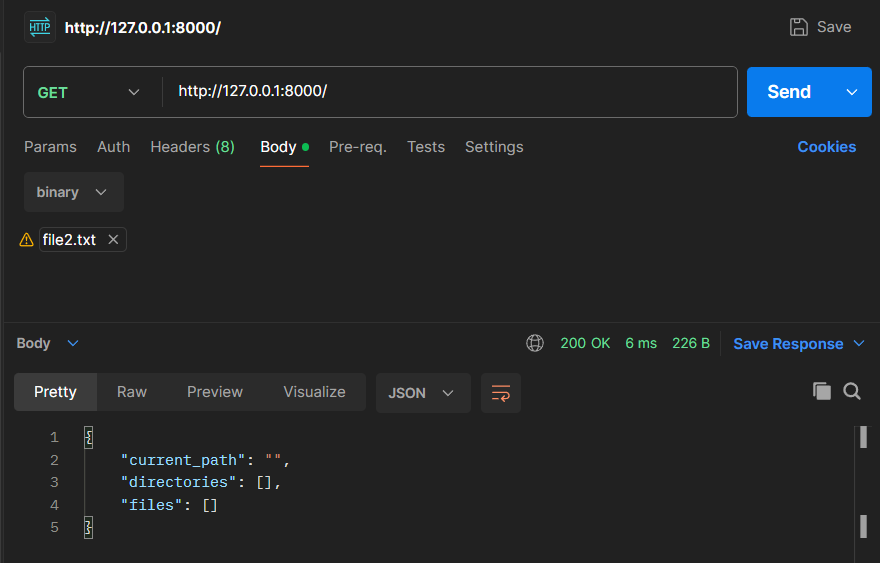
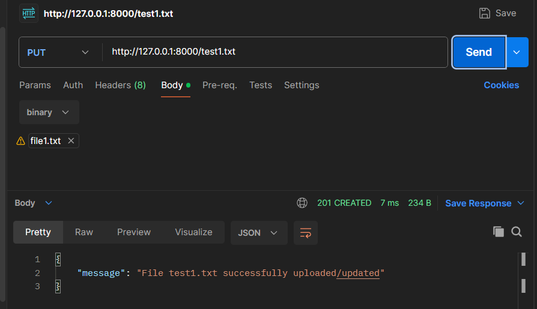
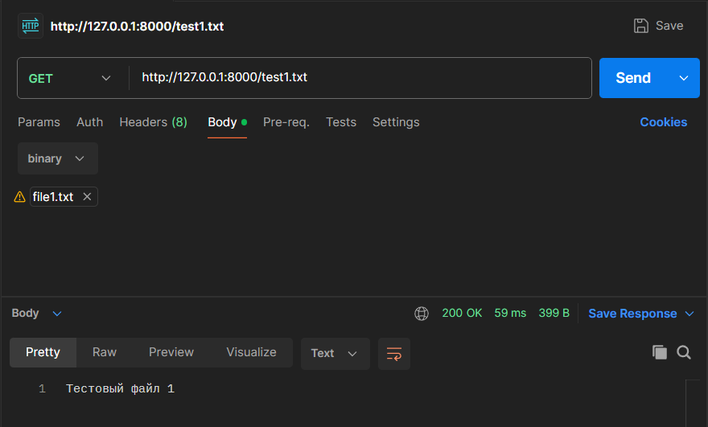
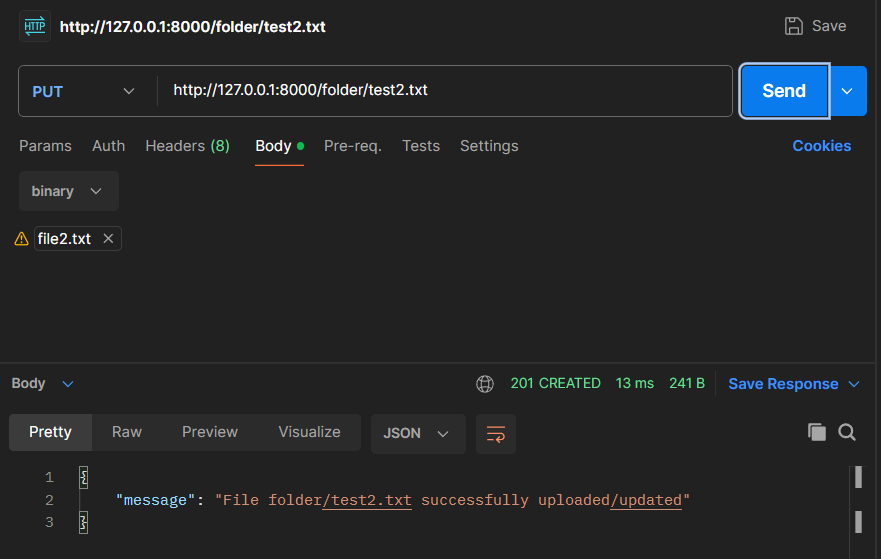
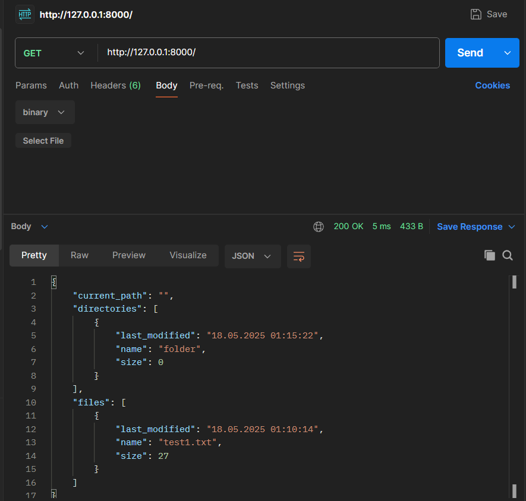
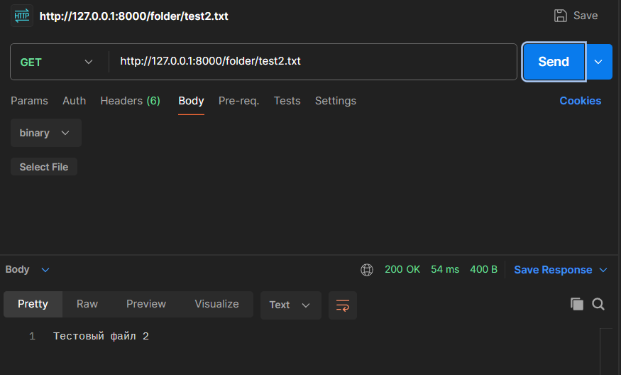
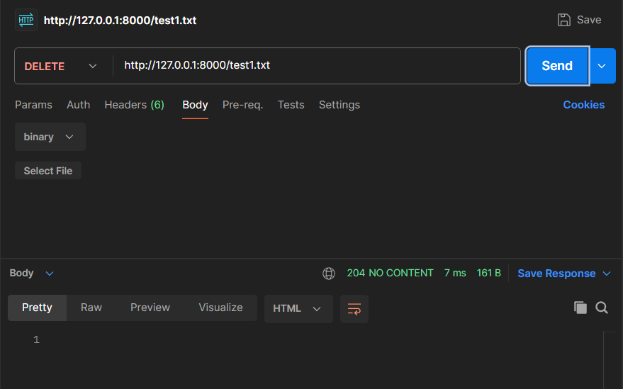
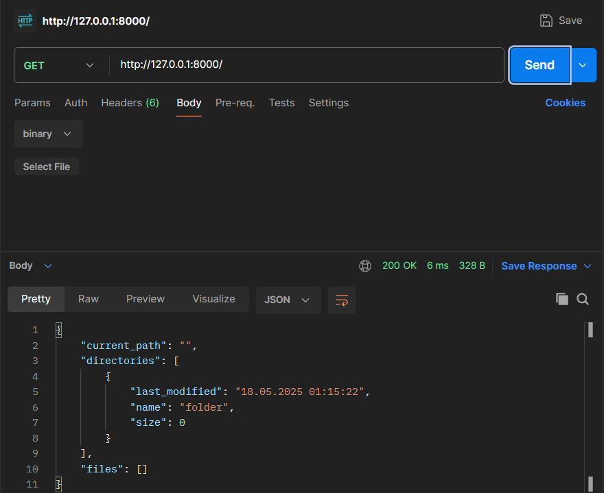

# Файловое хранилище

Тестирование через **Postman**

GET к корневому адресу:

PUT с выбранным локальным файлом:

GET для проверки файла с содержимым:

PUT для добавления файла во вложенную папку:

GET для проверки наличия новой папки:

GET для проверки вложенного файла:

DELETE для удаления файла в корневой папке:

GET для проверки удаления файла:

